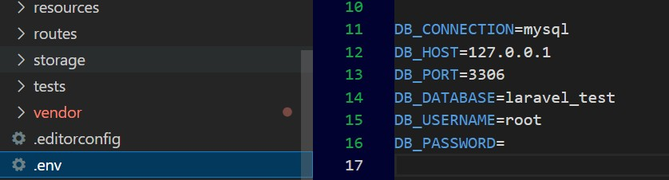
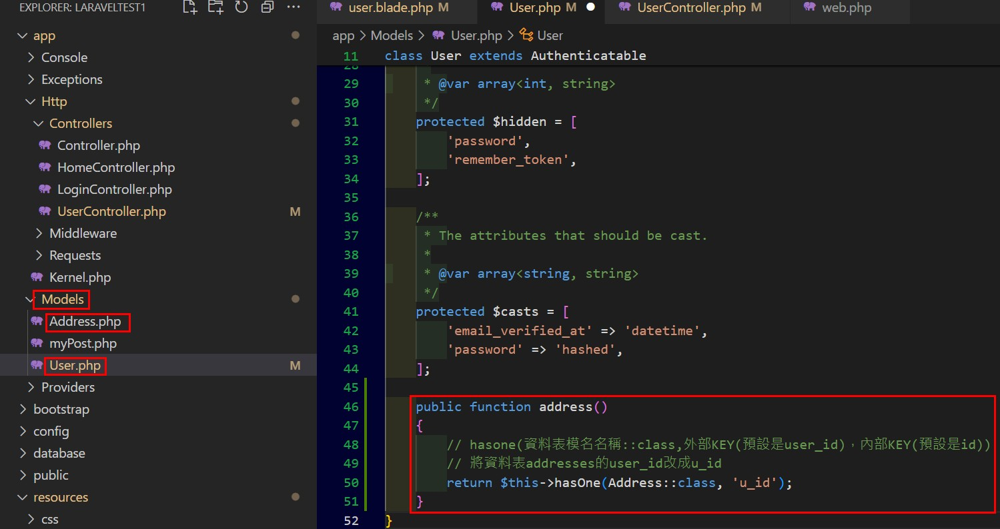
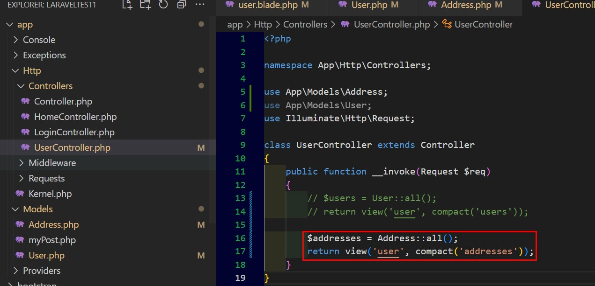

Build Multi Vendor Ecommerce Website (2023)
===

Use Laragon be host. 

Laragon是整合Apache跟mysql的服務程式，方便開發PHP程式

# 目錄
* [環境建置](#環境建置)
* [artisan](#artisan)
* [Routes](#routes)
* [View](#view)
* [Controller](#controller)
    * [form use token](#表單提交use-token使用csrf)
    * [form驗證](#form驗證validation)
* [Database](#database)
    * [建立資料庫](#建立migration檔案建立資料庫)
* [Eloquent-ORM](#eloquent-orm)
    * [透過artisan創建model](#透過artisan創建model)
    * [批量分配Mass-Assignment](#設定批量分配mass-assignment)
    * [製作假資料factory](#factory)
* [Eloquent關聯資料表](#eloquent關聯資料表)
    * [1對1互相關聯](#1對1兩個資料表互相關聯)
    * [反相關聯](#反相關聯)

# 環境建置

## 切換PHP版本

PHP版本下載: https://windows.php.net/downloads/releases/

將要換的PHP版本程式解壓縮後放在C:\laragon\bin\php之下，
在Laragon程式中點右鍵>PHP，即可切換版本

## VS_Laravel_extension
- Laravel Extension pack(整合包)

    Uninstall - EditConfig for vscode, Laravel Create view, Laravel Blade wrapper

- One Dark Pro

安裝Laravel
---
<a href='https://laravel.com/docs/10.x/installation'>Install Laravel</a>

Laragon點擊下方Terminal輸入

    composer global require laravel/installer

創建專案就再輸入

    laravel new [Project_Name]

## open_project

Laragon中點右鍵>www，可看到所有建立的專案

## 切換預設網站

Laragon中點右鍵>第二個項目>Switch Document Root>Select another，選到index網頁的那個路徑，像是Laravel專案就是選[Public]資料夾

## folder_structure
- [app]
    - [http]    
        - [Controllers]
        - [Middleware]
        - kernal.php - Middleware中的東西都會註冊在此檔案
    - [Models] - 檢索資料與資料庫通訊
    - [Provider] - 提供者的服務，Router, Event之類的
- [bootstrap] - 基本上不用動
    - [cache] - 系統會放一些暫存文件用於優化
- [config] - 常用
- [database]
    - [seeder] - 假數據庫
    - [migrations] - 重要! 編修資料表
- [public] - 開放檔案，如首頁index.php
- [resource]
    - [css]
    - [js]
    - [views] - 所有HTML程式都在放在這
- [routes] - 所有路由都放在這
- [storage] - 舊版本檔案?
- [test] - 測試檔案可放在這
- [vendor] - 所有laravel依賴庫(連結外部工具庫Libraries)
- .env - 環境變數，放資料庫連接字串或密碼之類的東西
- artisan - 
- composer.json - 所有庫之間關係的內容
- package.json - 有安裝的NPM會在這

# artisan
[Back Menu](#目錄)

查看artisan命令 - 在Cmder(terminal)輸入"php artisan"

常用命令:
- "php artisan serve" - 查看laragon伺服器的狀態與ip跟port，8000是laragon的預設PORT
- 所有命令後面加上"-h"就可以查看系統功能指令有哪些，譬如輸入"php artisan serve -h"
- "php artisan route:list" - 顯示所有應用程式的路由列表
- "php artisan tinker" - 進入php的即時運算功能，像是輸入"7 == "7"",會得到Ture的結果，輸入"strlen("ABCDE")"會得到5，可用來在網站運行中創建假數據測試之類的

### 查看所有Route

    php artisan route:list

## VS code的PHP錯誤

錯誤訊息:
 
    Cannot validate since a PHP installation could not be found. Use the setting 'php.validate.executablePath' to configure the PHP executable.

 

將C:\Users\user\AppData\Roaming\Code\User\settings.json中"php.validate.executablePath"的值設定為使用中的PHP版本執行檔路徑

ex:

    C:\\laragon\\bin\\php\\php-8.1.10-Win32-vs16-x64\\php.exe

# Routes
[Back Menu](#目錄)

在[routes]>web.php中定義

### 基本語法為`Route::get(URL,方法);`

ex:

    Route::get('about',function(){
        return "<h1>About Page</h1>;
    })

### 加上參數寫法
    Route::get('about/{id}',function($id){
       return $id;
    });

進入此網頁URL: "Localhost/about/12"

### 使用別名

避免URL太長，可使用此方式

先定義有別名的路由

    Route::get('about', function () {
        return "<h1>About Page</h1>";
    })->name('hello');

以別名方式製作的路由

    Route::get('home',function(){
    return "<a href='".route('hello')."'>home</a>";
    });

進入此網頁URL: "Localhost/home"，進入之後按下連結就會進入about網頁

### 使用別名套用參數

定義使用帶參數的路由別名

    Route::get('contant/{id}',function($id){
    return $id;
    })->name('edit-contant');

寫死帶入1

    Route::get('contant',function(){
        return "<a href='".route('edit-contant',1)."'>about contant</a>";
    });

進入此網頁URL: "Localhost/contant"

### 路由群組

可以在程式碼中省略相同的根目錄customer
或是有其他設計需求，相同的子網頁可以直接複製，只更換根目錄名稱，類似Model的概念

    route::group(['prefix' => 'customer'],function(){
        Route::get('/', function () {
            return "<h1>customer list</h1>";
        });
        
        Route::get('/create', function () {
            return "<h1>customer create</h1>";
        });
        
        Route::get('/show', function () {
            return "<h1>customer show</h1>";
        });
    });

進入此網頁URL: "Localhost/customer"
"Localhost/customer/create"
"Localhost/customer/show"

### Fallback Route

若輸入錯的URL不希望出現404網頁而是指定別的網頁

    route::fallback(function (){
        return "Route not exist";
    });

此段一定要放在web.php的最下面才會生效

# View
[Back Menu](#目錄)

給使用者看的網頁都會放在[resouces]>[views]裡

routes預設語法

    Route::get('/', function () {
    return view('welcome');
    });

指的是連接到[resouces]>[views]裡的welcome.blade.php，這就是View()的功能

所以可以在[views]裡建一個名為about.blade.php的網頁，然後在路由的web.php中加入以下語法

    Route::get('/about', function () {
        return view('about');;
    });

URL輸入"http://localhost/about"即可進入

檔案名稱的blade是讓laravel可以在HTML中使用Laravel功能，純PHP若要在PHP中使用PHP語法要加上

    <?php>
這個Blade可以用"@"開頭來表示此段是寫laravel語法，像是"@if".

### 網頁放在資料夾中

假設在[Views]中新增一個[contant]資料夾，裡面有一個index.blade.php網頁的呼叫方式如下

    Route::get('/contant', function () {
        return view('contant.index');;
    });

### 變數帶入View

web.app輸入以下代碼

    Route::get('/about', function () {
    $about = 'This is about page';
    $about2 = 'This is about two';
    return view('about',compact('about','about2'));;
    });

[view]的about.blade.php輸入以下代碼

    <h1>{{$about}}</h1>
    <h1>{{$about2}}</h1>

### 使用樣板

完成檔案結構如下

在[views]創建home.blade.php檔案，內容輸入如下

    @extends('layouts.master') {{-- 主樣板 --}}

    @section('content') {{-- master.blade.php中master.blade.php的內容 --}}
        <main role="main" class="container">
            <h1 class="mt-5 text-danger">Home</h1>
            Lorem,ipsum dolor
        </main>
    @endsection

在[views]下建立資料夾[layouts]，再建立master.blade.php，程式碼內容如下

    <!DOCTYPE html>
    <html lang="en">
    <head>
        <meta charset="UTF-8">
        <meta name="viewport" content="width=device-width, initial-scale=1.0">
        <meta http-equiv="X-UA-Compatible" content="ie=edge">
        <title>Home</title>
        <link href="https://cdn.jsdelivr.net/npm/bootstrap@5.0.2/dist/css/bootstrap.min.css" rel="stylesheet">
    </head>
    <body>
        @include('layouts.header')
            @yield('content')

        @include('layouts.footer')
    
        
        
    </body>
    </html>

在[layouts]建立header.blade.php，程式碼內容如下

    <nav class="navbar navbar-expand-lg navbar-light bg-light">
    

        <a class="navbar-brand" href="#">Navbar</a>
        <button class="navbar-togger" type="button" data-bs-toggle="collapse" data-bs-target="#navbarSupportedContent">
            
        </button>
        

            <ul class="navbar-nav me-auto mb-2 mb-lg-0">
                <li class="nav-item">
                    <a class="nav-link active" aria-current="page" href="#">Home</a>
                </li>

                <li class="nav-item">
                    <a class="nav-link" href="#">link</a>
                </li>
            </ul>
        

    

    </nav>

在[layouts]建立footer.blade.php，程式碼內容如下

    <footer class="bg-light text-center text-lg-start" style="position: fixed; width: 100%; bottom:0;">
    

        <a class="text-dark" href="#">WebSolutionUs</a>
    

</footer> 

在web.app建立一個指向home的Route，如下:

    Route::get('/home', function () {
    return view('home');;
    });

### 使用Foreach帶出條件式內容

在Route帶入變數內容如下:

    Route::get('/home', function () {
        $blogs = [
            [
                'title' => 'title one',
                'body' => 'this is body text',
                'status' => '1'
            ],
            [
                'title' => 'title two',
                'body' => 'this is body text',
                'status' => '0'
            ],
            [
                'title' => 'title three',
                'body' => 'this is body text',
                'status' => '1'
            ],
            [
                'title' => 'title four',
                'body' => 'this is body text',
                'status' => '1'
            ]
        ];
        return view('home', compact('blogs'));
    });

在home.blase.php輸入程式碼如下:

    @extends('layouts.master') {{-- 主樣板 --}}

    @section('content')
    <main role="main" class="container">
        <h1 class="mt-5 text-danger">Home</h1>
        Lorem,ipsum dolor

        

            @foreach ($blogs as $blog)
            @if ($blog['status'] == 1)
                

                    

                        

                            <h2>{{$blog['title']}}</h2>
                            
{{$blog['body']}}

                        

                    

                

            @else
                

                    

                        

                            <h2>{{$blog['title']}}</h2>
                            
{{$blog['body']}}

                            
Pending

                        

                    

                

            @endif
            @endforeach
    </main>
    @endsection

結果如下

# Controller
[Back Menu](#目錄)
## Create controller

開啟Terminal後進入專案路徑

輸入指令:

    php artisan make:controller HomeController

單動作控制器

    php artisan make:controller HomeController --invokable

資源控制器

    php artisan make:controller HomeController -r

## 表單提交Use Token(使用csrf)
### View內容
- form元素屬性要加method="POST" action="{{ route('login.sumbit') }}" 
- form元素下面那行要加一行@csrf
- input元素都要加上name屬性

        

            

                <h2 class="mb-4">Login</h2>
                

                    

                        <form action="{{ route('login.sumbit') }}" method="POST">
                            @csrf
                            

                                <label for="" class="form-label">User Name</label>
                                <input name="name" type="text" class="form-control">
                            

                            

                                <label for="" class="form-label">User Password</label>
                                <input name="password" type="text" class="form-control">
                            

                            

                                <label for="" class="form-label">User Email</label>
                                <input name="email" type="email" class="form-control">
                            

                            <button type="submit" class="btn btn-primary">Sumbit</button>
                        </form>
                    

                

            

        

### Controller內容
- 參數要加入Request，此處為提交後回傳的內容

    namespace App\Http\Controllers;
    use Illuminate\Http\Request;

    class LoginController extends Controller
    {
        public function handleLogin(Request $req)
        {
            dd($req->all());
        }
    }

### web.php
- 新增一個跟View相同名稱的POST方法

    Route::get('/login', [LoginController::class, 'index'])->name('login');

    Route::post('/login', [LoginCon troller::class, 'handleLogin'])->name('login.sumbit');

### app>Http>Middleware>VerifyCsrfToken.php

要確認內容為空，不然提交會有錯誤

## Form驗證Validation
[Back Menu](#目錄)
### LoginController提交內容加validate

    public function handleLogin(Request $req)
    {
        $req->validate([
            // 多條件驗證:必填，只能是英文字元，至少六個字元
            'name' => ['required', 'alpha', 'min:6', 'max:10'],
            'password' => 'required',
            'email' => ['required', 'email']
        ]);

        return $req;
    }

### View中在form元素前加入以下程式碼

    {{-- 驗證有任何錯誤就出現提示 --}}
            @if ($errors->any())
                @foreach ($errors->all() as $error)
                    
{{ $error }}

                @endforeach
            @endif

### 自定義驗證錯誤訊息

加上第二個[]參數

    {
        $req->validate([
            // 多條件驗證:必填，只能是英文字元，至少六個字元
            'name' => ['required', 'alpha', 'min:6', 'max:10'],
            'password' => 'required',
            'email' => ['required', 'email']
        ],[
            'name.required' => 'The name field is required!!',
            'name.alpha' => '只能是英文'
        ]);

        return $req;
    }

### 建立class製作驗證內容與自定義訊息
- 新增request

        php artisan make:request LoginRequest

    
app>http多一個Request資料夾，下面多一個LoginRequest.php

- 將裡面的authorize方法內容由flase改成true
- 將驗證項目跟自定義訊息都放到LoginRequest.php

    
最後LoginRequest.php內容如下:

        namespace App\Http\Requests;

        Illuminate\Foundation\Http\FormRequest;

        class LoginRequest extends FormRequest
        {
        /**
        * Determine if the user is authorized to make this request.
        */
            public function authorize(): bool
            {
                return true;
            }

            /**
            * Get the validation rules that apply to the request.
            *
            * @return array<string, \Illuminate\Contracts\Validation\ValidationRule|array<mixed>|string>
            */
            public function rules()
            {
                return [
                    'name' => ['required', 'alpha', 'min:6'],
                    'password' => 'required',
                    'email' => ['required', 'email']
                ];
            }

            public function messages()
            {
                return [
                    'name.required' => 'The name field is required!!',
                    'name.alpha' => '只能是英文'
                ];
            }
        }

    
LoginController.php內容變成如下

        namespace App\Http\Controllers;

        use App\Http\Requests\LoginRequest;

        class LoginController extends Controller
        {
            public function index()
            {
                return view('login');
            }

            public function handleLogin(LoginRequest $req)
            {
                return $req;
            }
        }

# Database
[Back Menu](#目錄)
- config>database.php中預設是使用mysql

    

- 在.env輸入資料庫資訊

    

## 建立實例
- Terminal輸入

    php artisan tinker

    

- terminal輸入
    DB::connection()->getPDO();

    
得到mysql的實例

    

## 建立Migration檔案建立資料庫

方便讓有專案的人可以快速建立相同的資料庫

## 範例建立posts資料表(僅創php檔)
- Terminal輸入

    php artisan make:migration create_posts_table

須以'create_'開頭，'_table'結束，忠鈿建議定義負數名稱(+s)

- 可在database>migrations資料夾下看到新建的table.php

    

- 建立自定義欄位

        public function up(): void
        {
            Schema::create('posts', function (Blueprint $table) {
                $table->id();
                $table->string('title');
                $table->text('description');
                $table->boolean('status');
                $table->timestamps();
            });
        }

    

- terminal輸入:

        php artisan migrate

    
產生database>migrations內所有的資料表(其中有預設資料表)

    

    
查看資料庫內容也會出現資料表

    

- 更多資料類型與用法

        $table->string('title', 100); // 255
        $table->decimal('amount')->nullable(); // 可空白
        $table->double('double')->default(0); // 預設值
        $table->float('float');
        $table->integer('integer');
        $table->timestamp('email_verified');

## 更多migration命令
- 重置現有的資料庫(刪除所有資料表只剩下資料表migrations)

        php artisan migrate:reset

- 新增欄位(不會刪除舊資料)

    * 新增一個要新增欄位的資料表同名的add table(以'add_'開頭，'_table'結尾)

            php artisan make:migration add_posts_table --table=posts

    

    * 在這個add檔案加入要新增的欄位(因為已有舊資料在表內，所以新的欄位要加上nullable()或是default())

    

    * 執行migrate

            php artisan migrate

- 新增欄位(**會刪除資料內容!!** php artisan migrate只會新增目前沒有的資料表，不會新增資料表內的新欄位)

        php artisan migrate:refresh

- 回到上一次的資料庫狀態(可能新建的資料表會消失,不會復歸新增的欄位)

        php artisan migrate:rollback

- 只遷移單一資料表(指定資料表的php路徑)

        php artisan migrate --path=/database/migtations/2024_03_17_044156_create_posts_table.php

- **刪除所有資料**
    
migrations資料夾裡的檔案都會執行，若欄位有減少，要查相同資料表名稱的檔案

        php artisan migrate:fresh

## 創建假資料
- 創建假資料用的php檔，檔名建議跟資料表名稱相關

        php  artisan make:seeder PostSeeder

    
在database>seeders資料夾中就產生檔案

- 輸入要新增資料內容(迴圈產生10筆)
    
要有建立Model程式碼才會過

        for ($i = 0; $i <= 10; $i++) {
            DB::table('posts')->insert([
                'title' => Str::random(20),
                'description' => Str::random(30),
                'status' => 1,
                'Publish_date' => date('Y-m-d'),
                'user_id' => 1,
            ]);
        }

    

- 在DatabaseSeeder.php新增呼叫

        $this->call(PostSeeder::class);

    

- 執行

        php artisan db:seed

    

## Query builder
- 在controller回傳DB搜尋結果

    return DB::table('posts')->get();    //all data
    return DB::table('posts')->find(7);  //id=7
    return DB::table('posts')->first(); //第一筆
    // 只搜尋最多2個欄位(相同資料只會有一筆)
    return DB::table('posts')->pluck('id', 'title', 'user_id');
    return DB::table('posts')->where('id', '>', 3)->where('id', '<', 8)->get();

    

- insert 

        DB::table('posts')->insert([
            [
                'title' => 'This is one',
                'description' => 'des 1',
                'status' => 1,
                'Publish_date' => date('Y-m-d'),
                'user_id' => 1
            ],
            [
                'title' => 'This is two',
                'description' => 'des 2',
                'status' => 0,
                'Publish_date' => date('Y-m-d'),
                'user_id' => 2
            ]
        ]);

- update

        DB::table('posts')->where('id', 12)->update([
            'title' => 'This is one updated',
            'description' => 'des 1 updated'
        ]);

- delete

        DB::table('posts')->where('id', 12)->delete();

- join

    

    

    
搜尋條件[posts]的category_id=[categories]的id，兩個資料表全部欄位

        return DB::table('posts')->join('categories', 'posts.category_id', '=', 'categories.id')
            ->get();

    

    
只要顯示categories的欄位

        return DB::table('posts')->join('categories', 'posts.category_id', '=', 'categories.id')
            ->select('categories.*')
            ->get();

    

- 使用聚集Aggregates

    
得到資料筆數

        return DB::table('posts')->count();

    
欄位內容總和

        return DB::table('posts')->sum('id');

# Eloquent ORM
[Back Menu](#目錄)
- Eloquent
    
Laravel中的一種類別

- ORM
    <>用物件導向的方式操作DB
- Model
    
Model基本上是用來跟DB交換資料

## 透過Artisan創建Model

範例使用Post當成預創建的Model名稱(資料表名稱為複數posts，建議命名成資料表的單數，這樣就有符合Laravel的規則他就知道要找哪個table)

    php artisan make:model Post

產生後的基本內容-繼承Model

舉例在HomeController要取得posts table所有內容

Home網頁結果

改成不是table名稱的單數的Model

開啟home網頁可以從錯誤中看到他會找model名稱的複數名的table

在Model內指定table名稱即可

    protected $table = 'posts';

筆記 : 建立Model時一起建立migration create

    php artisan make:model Tag -m

## 幾個透過Eloquect ORM設定資料的方法
- 指定某個id的資料或是使用foreach顯示資料
    

- 使用Where加上複數and, or條件顯示資料
    

- 使用insert範例
    

- update範例

        // 用get()會回傳陣列會失敗，所以要用first()
        $Post = myPost::where('user_id', '=', 2)->first();  
        $Post->title = 'this is new three';
        $Post->description = 'this is new three desc';
        $Post->user_id = 3;
        $Post->save();  //執行
        dd('success');  //執行後訊息

- delete範例

        $Post = myPost::where('user_id', 9999)->delete();

## 設定批量分配Mass Assignment

定義允許或不允許修改的資料表欄位避免程式漏洞

- 在所屬Model中定義

    

- 如果沒定義fillable

    

- 若修改保護的欄位出現的錯誤

    

- Insert範例

        $post = myPost::create([
            'title' => 'this is title from Mass assign 02',
            'description' => 'this is description from Mass assign 01',
            'status' => 0,
            'Publish_date' => date('Y-m-d'),
            'user_id' => 1,
            'category_id' => 11,
        ]);
        dd('success');

- update範例

        $post = myPost::where('status', 1)->update([
            'status' => 0
        ]);
        dd('success');

## 軟刪除softDeletes(only for Eloquent ORM)

執行這個步驟後，該資料表會出現一個deleted_at的欄位，使用Laravel的Delete()方法刪除這個資料表的資料後，只會在該筆資料的deleted_at欄位出現一個日期，之後使用Laravel的方法搜尋這個資料表時將不會出現deleted_at欄位有內容的資料

- 在此資料表的Model引用SoftDeletes

    

- 將要增加軟刪除的資料表新增欄位-使用Migrate方式

        php artisan make:migration add_posts_table --table=posts

    

- 在up()加上

        $table->softDeletes();

- 在down()加上

        $table->dropSoftDeletes();;        

    

- 執行修改好的migrate檔案

        php artisan migrate --path=/database/migrations/2024_04_07_031406_add_posts_table.php

    

- db出現欄位deleted_at

    

### 搜尋軟刪除的資料

    return myPost::onlyTrashed()->get();

### 恢復軟刪除的資料(deleted_at內容變成null)

    myPost::withtrashed()->find(id)->restore();

### 永遠刪除資料(deleted_at已有內容)

    myPost::withtrashed()->find(id)->forceDelete();

## Factory
[Back Menu](#目錄)

用來製作資料表的假資料

### 創建名為myPostFactory的factory

myPost為model的名稱!!

    php artisan make:factory myPostFactory

出現factories資料夾跟內容

### 輸入要產生假資料的欄位

    return [
            'title' => fake()->sentence(),
            'description' => fake()->paragraph(),
            'status' => rand(0, 1),
            'Publish_date' => fake()->date(),
            'user_id' => 1,
            'category_id' => rand(1, 4)
        ];

### 註冊[seeders]>[DatabaseSeeder]

創建兩百筆資料

    myPost::factory(200)->create();

### 執行

    php artisan db:seed

### 若資料想換掉可執行fresh將所有資料刪除

migrations資料夾內的檔案將決定fresh後的欄位內容!!

    php artisan migrate:fresh

# Eloquent關聯資料表
[Back Menu](#目錄)

重點:若有資料表要互相關聯，子資料表名稱命名為複數名詞，主資料表的欄位以子資料表單數名詞 + "_id"，就可發揮關聯功能‧，若沒有遵守就要在has或belong的參數加入詳細從屬資訊(命名照規則就只需輸入$related內容)

## 1對1兩個資料表互相關聯
- 使用資料表users的欄位id去關聯資料表addresses的欄位u_id顯示在user.blade.php > hasOne()
- 資料表users資料表有欄位id

    

- 資料表addresses資料表有欄位u_id

    

- 在UserController取得users資料

    

- 在User的Model關聯address的model

    

- 在User的View帶入內容

        @foreach ($users as $user)
            

                

                    

                        <h4>{{ $user->name }}</h4>
                        
{{ $user->email }}

                        
{{ $user->address }}

                    

                

            

        @endforeach
    
    

- 結果

    

- 在User的View改成只要address

        
{{ $user->address->address }}

    
    

- 結果

    

## 反相關聯
- 在Address的Model反向關聯User的model > belongsTo()

    

- 在Controller改成引入資料表addesses

    

- 在view中改成迴圈帶入addresses資料

    

- 結果
    
    

## 1對多關聯

- 將資料表posts裡每筆資料的category_id都跟資料表categories的某一筆資料相關聯

- 使用資料表catagories的欄位id去關聯資料表posts的欄位category_id顯示在user.blade.php > hasMany()

- 在Model Category定義跟posts的Model(myPost)關聯多筆資料

    

- 在Model myPost定義屬於Category (由於有照命名規則，所以此處表示posts的欄位category_id的內容假設為1，將替換為資料表categroies內id為1的欄位name內容)

    

- Controller中定義回傳從資料表posts的欄位category_id為1的資料 ，因為category的Model有定義category有關連posts的多筆資料所以寫法是用

        $categories = Category::find(1)->posts;

    

- 資料表categories中id為1的內容是Olson

    

- 資料表posts的category_id有1~4的資料

    

- view設計category_id的內容用資料表categories的name代替

    

- 只顯示catagory_id的資料，並秀出所屬的categories的name

    

## 多對多關聯

- 一個資料表內的多筆資料跟另一個資料表的多筆資料相關聯

- 建立一個資料表post_tag，用來將資料表posts(發文內容)的資料加上標籤tag，以便可以看到posts的每筆資料的tag有哪些(類似臉書的標註#)

   

- 建立一個資料表tags，只有一個欄位name，輸入四筆資料

   

- 在posts的Model加入tags的方法，設定Tags的資料跟posts的資料多關聯

   

- 新增一筆資料到資料表post_tag，表示將posts的第一筆資料加上tags的第一筆資料，表示posts的第一筆資料的標籤"php"

   

- 進入網頁後，會是一片空白

   

- 資料表post_tag會多一筆資料

   

- 查看post的第一筆資料並且加上關聯的標籤tag

    

- 結果

    

- 要將posts的第一筆資料變成跟tags的四筆資料都相關聯，先寫入對應關係到資料表post_tag

    

- 瀏覽器重整http://localhost/PostTag之後，資料表多出3筆資料，表示posts的第一筆資料有4個標籤

    

- 再次查看post的第一筆資料並且加上關聯的標籤tag

    

- 修改controller取得目前的posts的第一筆資料關聯tags資料

    

- 修改PostTag的View，顯示posts的tltie跟description資料，並且加上此筆資料的tag有哪些

    

- 加上標籤tag後的結果

    