### 安裝微軟套件管理器Chocolatey
以系統管理員身分執行PowerShell輸入

    Set-ExecutionPolicy Bypass -Scope Process -Force; [System.Net.ServicePointManager]::SecurityProtocol = [System.Net.ServicePointManager]::SecurityProtocol -bor 3072; iex ((New-Object System.Net.WebClient).DownloadString('https://community.chocolatey.org/install.ps1'))

驗證是否安裝成功

    choco
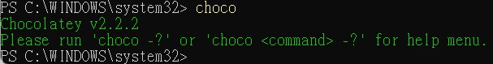

### 需要使用Node.js, JDK
* 在PowerShell輸入以下命令(不能裝JAVA官網的JDK，要用這個17版的)
        
        choco install -y nodejs-lts microsoft-openjdk17

* 安裝後查詢JAVA版本

        javac -version

### Yarn是Facebook 提供的替代npm 的工具，可以加速node 模組的下載。

    npm install -g yarn

* 安裝完yarn 之後就可以用yarn 代替npm 了，例如用yarn代替npm install指令，用yarn add 某第三方庫名代替npm install 某第三方庫名。

### 啟用Hyper-V

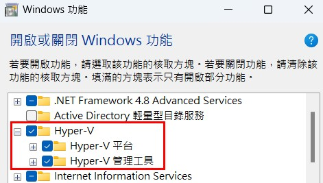
### 下載Android Studio

https://developer.android.google.cn/studio?hl=zh-tw

安裝中須選取以下項目，都是預設項目

* Android Virtual Device
* Android SDK
* Android SDK Platform

RN 目前支援android 5 以上裝置

## Android Studio設定

* 開啟SDK
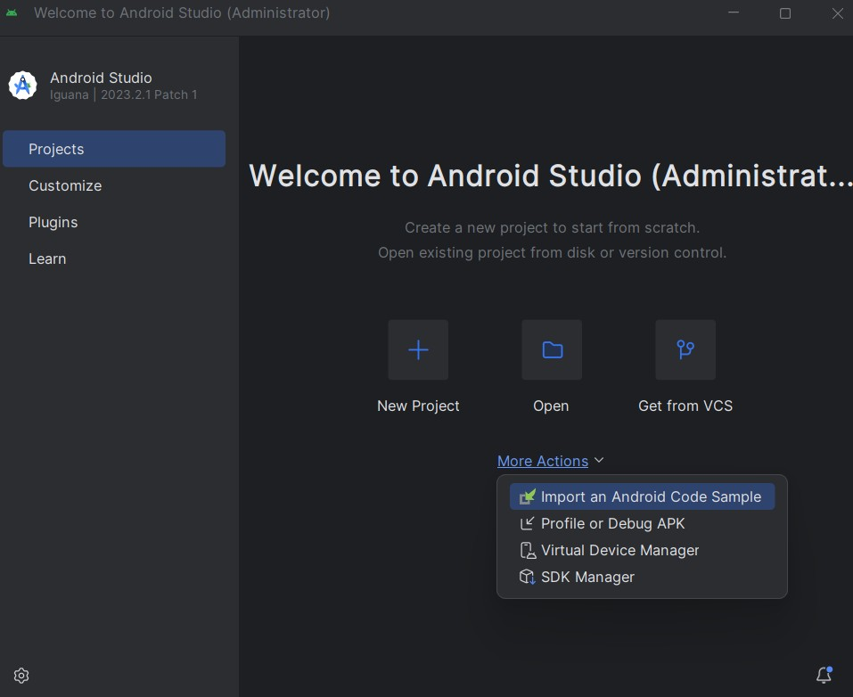

* SDK Platforms右下角勾選"Show Package Details",
勾選下圖項目
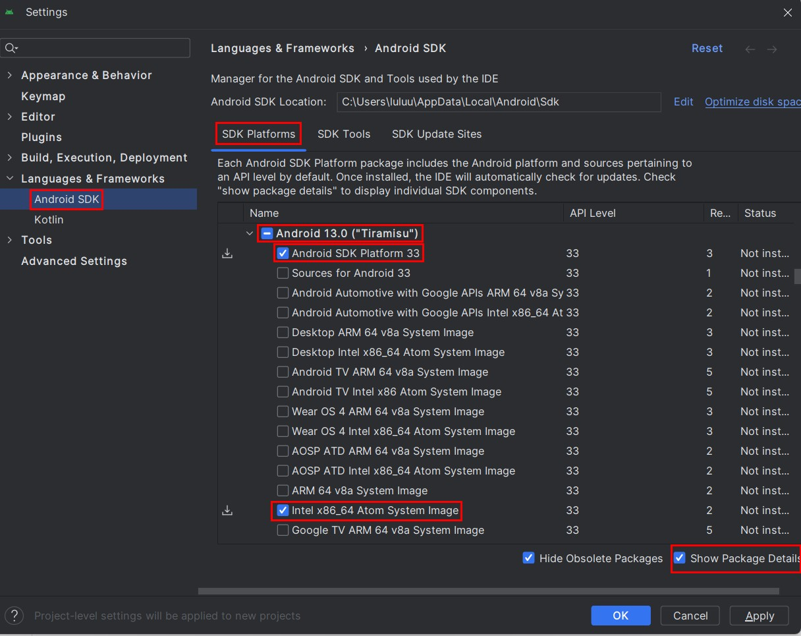

* SDK Tools右下角勾選"Show Package Details",
勾選下圖項目，確保選取了React Native 所必須的33.0.0版本
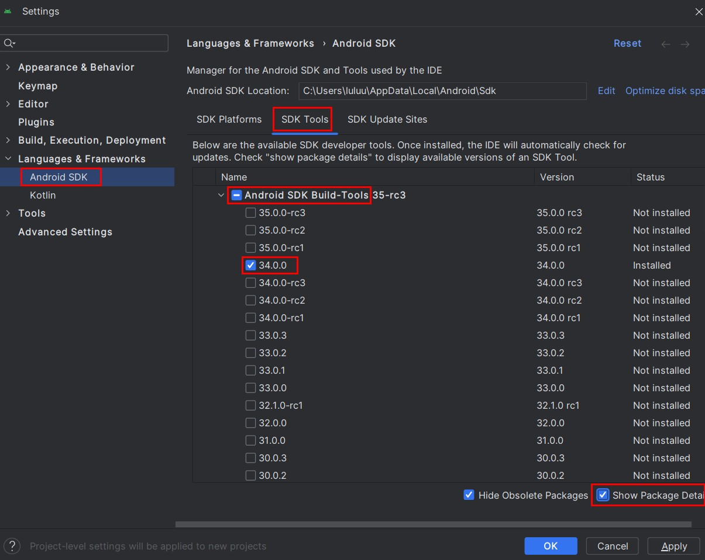

* 設定環境變數1
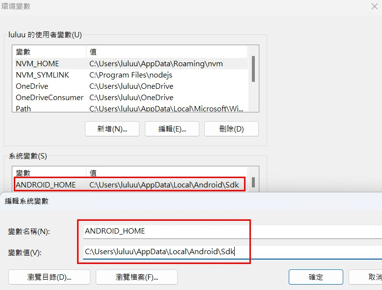

* 設定環境變數2 - platform-tools、emulator、tools、tools/bin
    * %ANDROID_HOME%\platform-tools
    * %ANDROID_HOME%\emulator
    * %ANDROID_HOME%\tools
    * %ANDROID_HOME%\tools\bin

* 設定環境變數3 - JAVA_HOME
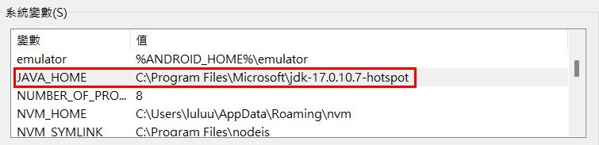

* 如果之前全域安裝過舊的react-native-cli命令列工具，請使用npm uninstall -g react-native-cli卸載掉它以避免一些衝突

        npm uninstall -g react-native-cli @react-native-community/cli

* 確認環境變數設定正確，在Powershell輸入

        Get-ChildItem -Path Env:\
    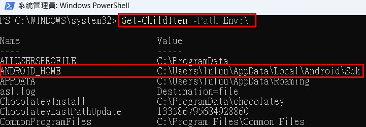

* 新增虛擬設備

    * 選擇新增
    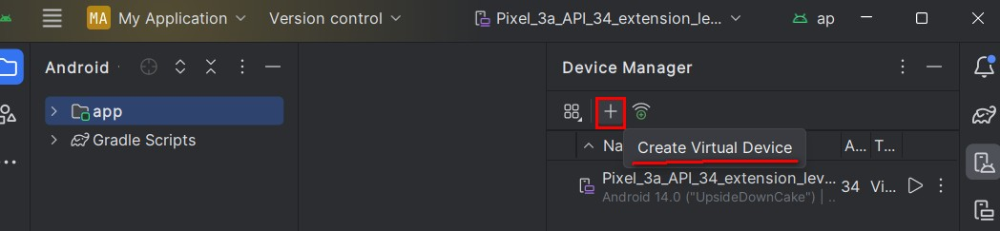
    * 確認Tiramisu已有下載
    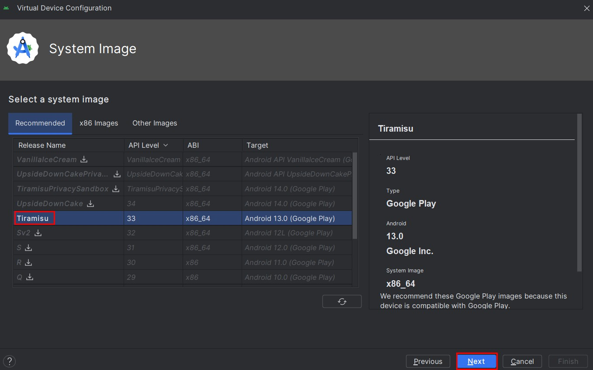
    * 設定完成
    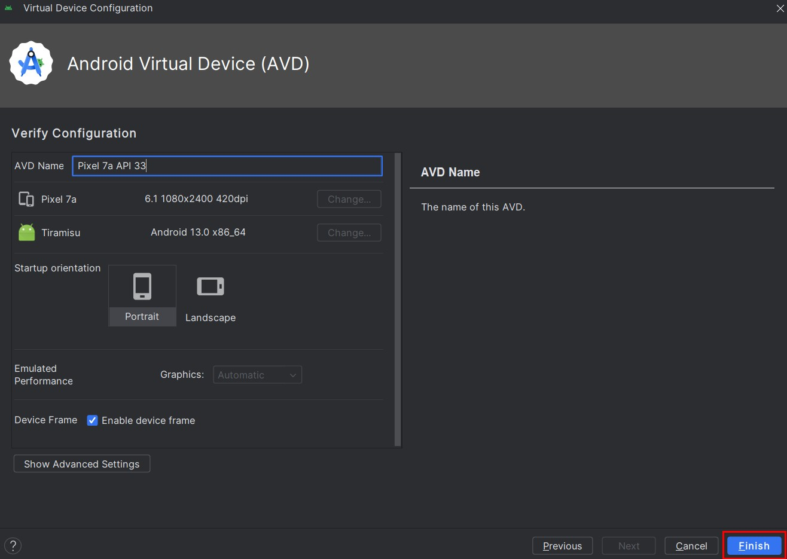

## 建立RN專案 - 範例名稱AwesomeProject
    npx react-native@latest init AwesomeProject
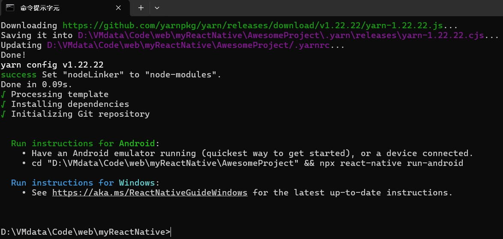

###創建時也可選版本

    npx react-native@X.XX.X init AwesomeProject --version X.XX.X

也可以使用--template來使用一些社區提供的模板。

## File Structure

* 資料夾ios and android - 將js轉成手機程式
* Package.json - 專案版本與各種引用套件
* index.js - 程式進入點，註冊元件
* App.tsx - 首頁內容
* App.json - 應用程式基本詳細資訊
* babel.config.js - 宣告模擬器或瀏覽器版本
* tsconfig.json - 配置TypeScript
* metro.config.js - 即時更新?
* .watchmanconfig - 觀察有無變化以便指示metro.config.js即時更新
* Gemfile - Ruby用的?瀏覽器有關?
* prettierrc.js - 自動排版規則
* .eslintrc.js - 語法檢查規則

## 執行程式到虛擬機
* 範例程式碼App.tsx

        import react from 'react';
        import {Text, View, Button} from 'react-native';

        let name = 'Peter';
        const lastName = 'Jordan';
        const age = 20;

        const App = () => {
        return (
                <View>
                <Text style={{fontSize: 30}}>Text,View and Button</Text>
                <Text style={{fontSize: 50}}>{name + " " + lastName}</Text>
                <Button title='submit' />
                <View>
                <Text style={{fontSize: 50}}>{age}</Text>
                <Text style={{fontSize: 20}}>{10-5}</Text>
                <Text style={{fontSize: 40}}>{age<=30?"your age is " + age:"age is not matching"}</Text>
                {
                    age>=30?
                    <Text style={{fontSize: 30, color : 'green'}}>{"your age is " + age}</Text>
                    :
                    <Text style={{fontSize: 40, color : 'red'}}>{"age is not matching"}</Text>
                }
                </View>
                </View>
            );
        };
        export default App;

* Android

        npx react-native run-android
* 執行結果
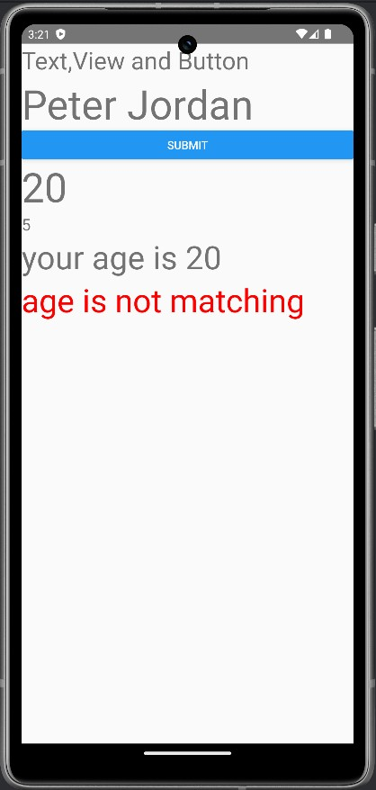

### 以使用元件的方式顯示
* 範例程式 - 同檔案內的元件

        const App = () => {
        return (
            <View>
            <Text style={{fontSize: 30}}>Text,View and Button</Text>
            <UserData />
            </View>
        );
        };

        const UserData=()=>{
        return(
            <View>
            <Text style={{fontSize: 40}}>Name</Text>
            <Text style={{fontSize: 20}}>age</Text>
            <Text style={{fontSize: 20}}>Email</Text>
            </View>
        
        )
        }
        export default App;

* 執行結果

    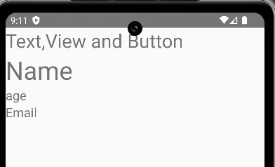
* 不同檔案內的元件

    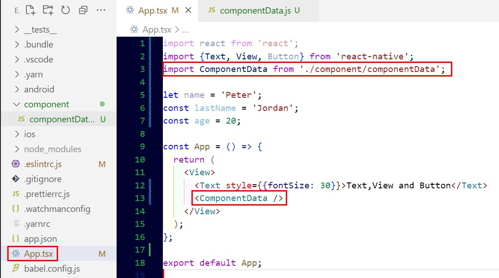
    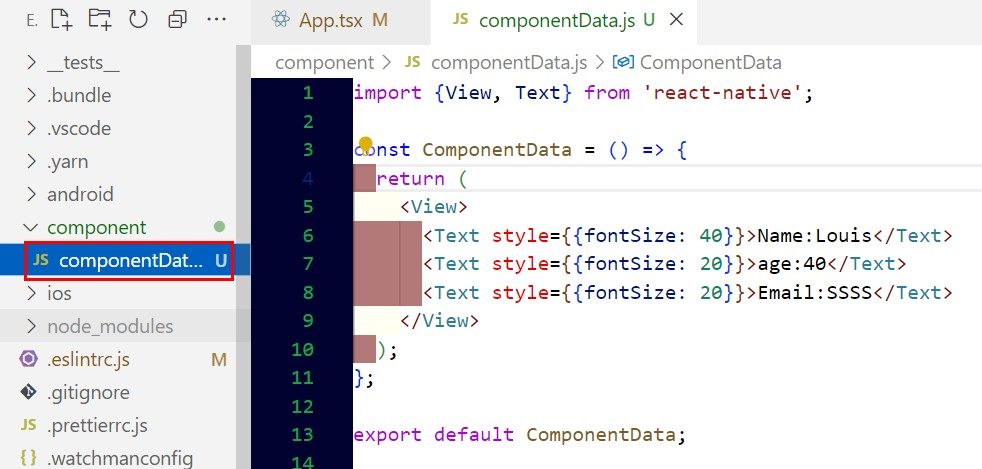

### 使用Hook

* UI元件顯示需使用useState(hook)才能更改
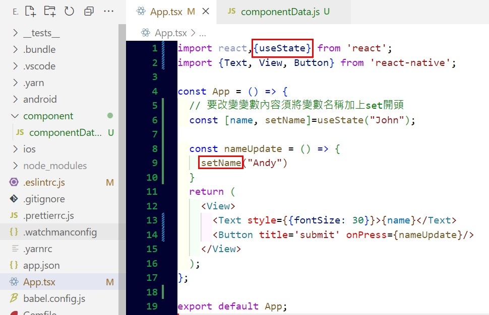
按下按鈕後變成Andy

    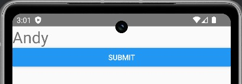

### 元件代入參數

    import react,{useState} from 'react';
    import {Text, View, Button} from 'react-native';

    const App = () => {
    const [name, setName]=useState("John");

    const nameUpdate = (req) => {
        setName(req) 
    }
    return (
        <View>
        <Text style={{fontSize: 50}}>John > Leo</Text>
        <Text style={{fontSize: 30}}>{name}</Text>
        {/* 因為要對函式帶參數，所以要寫成()=>開頭 */}
        <Button title='submit' onPress={()=>nameUpdate("Leo")}/>
        {/* 元件代入參數 */}
        <User name={name} age={27} />
        </View>
    );
    };
    
    // 使用參數，props可任意命名
    const User=(props) => {
    return(
        <View style={{backgroundColor:'lightgreen'}}>
        <Text style={{fontSize: 30}}>Name : {props.name}</Text>
        <Text style={{fontSize: 30}}>Age : {props.age}</Text>
        </View>
    )
    }
    export default App;

### 內部與外部檔案引用樣式Style

* 新增js檔案並輸入想要的style(可以設計一種元件一個檔，像是相同類型的按鈕)
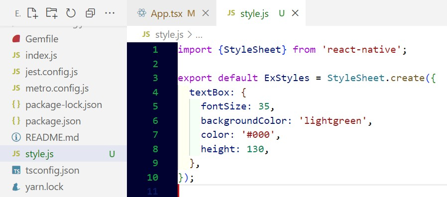

* 引入style檔案並使用

        import react from 'react';
        import {Text, View, Button, StyleSheet} from 'react-native';
        import ExStyles from './style'

        const App = () => {
        return (
            <View>
            <Text style={{fontSize: 40, backgroundColor:'red', color:'#fff'}}>Style in React Native</Text>
            <Text style={styles.textBox}>Style in React Native</Text>
            <Text style={styles.textBox}>Style in React Native</Text>
            <Text style={styles.textBox}>Style in React Native</Text>
            <Text style={ExStyles.textBox}>Style in React Native</Text>
            <Text style={[ExStyles.textBox, styles.textBox]}>Style in React Native</Text>
            </View>
        );
        };

        // 另一個內部引用style
        const styles = StyleSheet.create({
        textBox:{
            fontSize:25,
            backgroundColor:'blue',
            color:'#fff',
            height:100,
            marginBottom:10,
            textAlignVertical:'center',
            textAlign:'center',
            borderColor:'red',
            borderWidth:3,
            borderRadius:20
        }
        })
        export default App;

### 文字輸入TextInput

    import react, { useState } from 'react';
    import {Text, View, Button,TextInput, StyleSheet} from 'react-native';

    const App = () => {
    const [name, setName]= useState('Andy');
    return (
        <View>
        <Text style={{fontSize: 40, backgroundColor:'red', color:'#fff'}}>Handle Text Input</Text>
        <Text style={{fontSize: 40}}>Your name is : </Text>
        <TextInput 
            style={styles.TextInput}
            placeholder='Enter your name'
            value={name}  //讓Button可以清除輸入中的字
            onChangeText={(text)=>setName(text)}  //即時更改
        />
        <Button title='clear textInput' onPress={()=>setName('')} />
        </View>
    );
    };

    const styles = StyleSheet.create({
    TextInput:{
        fontSize:25,
        color:'blue',
        borderColor:'black',
        borderWidth:2,
        borderRadius:20,
        margin:10
    }
    })
    export default App;
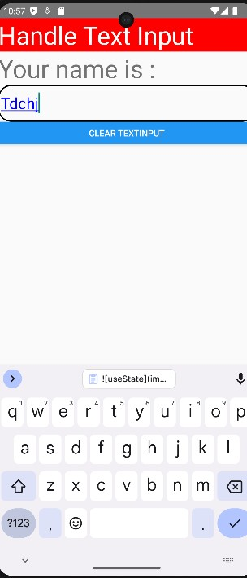

### 名稱密碼電子郵件表單Form
    import react, { useState } from 'react';
    import {Text, View, Button,TextInput, StyleSheet} from 'react-native';

    const App = () => {
    const [name, setName]= useState('');
    const [pwd, setPWd]= useState('');
    const [email, setEmail]= useState('');
    const [display, setDisplay]= useState(false);
    // 清除所有內容
    const resetForm = () => {
        setName("");
        setPWd("");
        setEmail("");
        setDisplay(false);
    }
    return (
        <View>
        <Text style={{fontSize: 40, backgroundColor:'red', color:'#fff'}}>Simple Form in React Native</Text>
        <Text style={{fontSize: 40}}>Your name is : </Text>
        <TextInput 
            style={styles.TextInput}
            placeholder='Enter your name'
            value={name}  //讓Button可以清除輸入中的字
            onChangeText={(text)=>setName(text)}  //即時更改
        />
        <TextInput 
            style={styles.TextInput}
            placeholder='Enter your password'
            value={pwd}  //讓Button可以清除輸入中的字
            secureTextEntry={true}  //顯示*字元
            onChangeText={(text)=>setPWd(text)}  //即時更改
        />
        <TextInput 
            style={styles.TextInput}
            placeholder='Enter your Email'
            value={email}  //讓Button可以清除輸入中的字
            onChangeText={(text)=>setEmail(text)}  //即時更改
        />
        {/* 做一點間隔 */}
        <View style={{marginBottom:10}}>
            <Button title='Get Details' color={"green"} onPress={()=>setDisplay(true)} />
        </View>
        <Button title='clear Details' onPress={()=>resetForm()} />
        <View>
            {
            display ? //如果為true才顯示資訊
            <View>
                <Text style={{fontSize:20}}>{name}</Text>
                <Text style={{fontSize:20}}>{pwd}</Text>
                <Text style={{fontSize:20}}>{email}</Text>
            </View>
            :null
            }
        </View>
        </View>
    );
    };

    const styles = StyleSheet.create({
    TextInput:{
        fontSize:25,
        color:'blue',
        borderColor:'black',
        borderWidth:2,
        borderRadius:20,
        margin:10
    }
    })
    export default App;
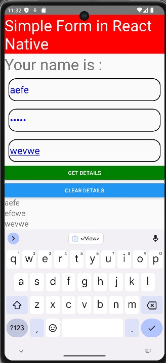

## Listform - FlatList or ScrollView + map

    import react, { useState } from 'react';
    import {Text, View, StyleSheet, FlatList, ScrollView} from 'react-native';

    const users = [
    {name:"Louis",id:1},{name:"Tom",id:2},{name:"Andy",id:3},{name:"Bob",id:4},
    {name:"Emma",id:5},{name:"Tony",id:6},{name:"Jack",id:7},{name:"Amy",id:8},
    {name:"John",id:9},{name:"Mark",id:10},{name:"Steven",id:11},{name:"playback",id:12},
    ]
    const App = () => {

    return (
        <View>
        <Text style={{fontSize: 30}}>List with Flat List Component</Text>
        <FlatList
        // FlatList本身就有滾動條；item是users的屬性
        data={users}renderItem={({item}) => <Text style={styles.listItem}>{item.name}</Text>}
        />   

        {/* <ScrollView> */}
            {/* 使用map做清單的話沒有滾動條，要用ScrollView包起來才會有 */}
            {
            // users.map((item)=><Text style={styles.listItem}>{item.name}</Text>)
            }
        {/* </ScrollView> */}
        
        </View>
    );
    };

    const styles = StyleSheet.create({
    listItem:{
        fontSize:60,
        color:'#FFF',
        backgroundColor:"blue",
        borderColor:'black',
        borderWidth:1,
        borderRadius:20,
        margin:10,
        padding:10
    }
    })
    export default App;
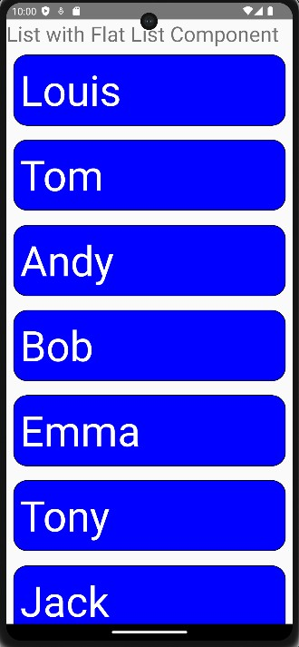

## Grid卡片

    const App = () => {

    return (
        <View>
        <Text style={{fontSize: 30}}>Grid with Dynamic Data</Text>
        <View style={{flex:1, flexDirection:'row', flexWrap:'wrap'}}>
        {
            users.map((item)=><Text style={styles.item}>{item.name}</Text>)
        }
        </View>
        </View>
    );
    };
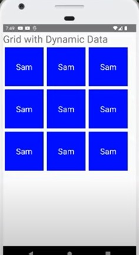

